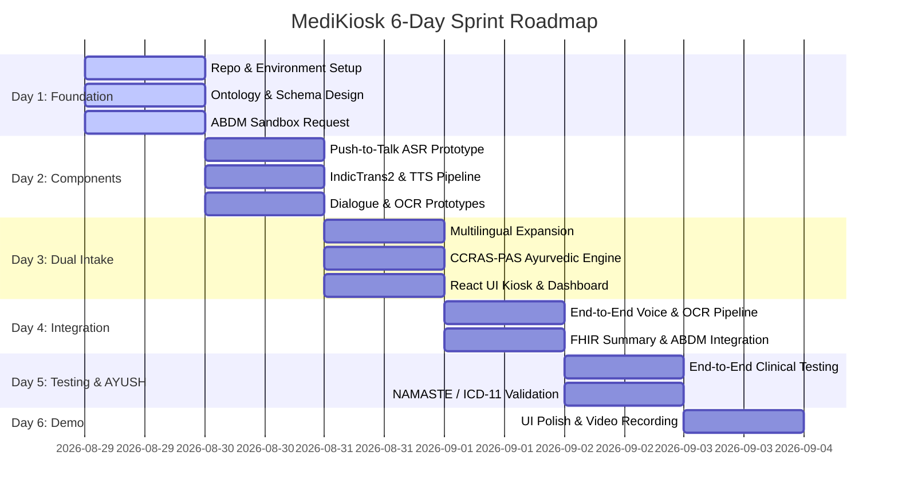

# 🗺️ MediKiosk — 6-Day Development & Implementation Roadmap

> **Problem Statement 26047:** Patient Case-Taking Software (Ministry of Ayush / AIIA)  
> **Sprint Horizon:** 6-Day High-Velocity Build  
> **Team Structure:** 5 ML Engineers + 1 Full-Stack Developer  

---

## 🎯 High-Level Milestones Summary

---

## 📅 Day-by-Day Implementation Roadmap

### 🏁 Day 1 — Infrastructure & Clinical Baseline
**Goal:** Establish repository standards, configure API credentials, freeze clinical schemas, and request ABDM sandbox access.

- [ ] **Infrastructure & Repo Scaffold**
  - [ ] Initialize git repository and directory hierarchy (`/backend`, `/frontend`, `/docs`, `/scripts`).
  - [ ] Configure environment variable templates (`.env.example`) for AI4Bharat, OpenAI/Anthropic/Gemini, Cloud Vision, and Supabase keys.
  - [ ] Initialize Supabase project (Postgres DB + `pgvector` extension enabled).
- [ ] **Clinical Ontology & Question Battery (Team Priority)**
  - [ ] Freeze standard allopathic history schema (Chief Complaint, HPI, Past/Drug/Family History, ROS).
  - [ ] Digitate and structure the **CCRAS Prakriti Assessment Scale (PAS)** battery into standard JSON format.
  - [ ] Define the dual-mode dialogue schema (`history_type: allopathic | ayurvedic`).
- [ ] **Core Setup Tasks**
  - [ ] **Dev:** Implement FastAPI skeleton backend with healthcheck endpoints.
  - [ ] **Dev:** Register for ABDM Sandbox access immediately (3-4 day approval window).
  - [ ] **ML 1 + Dev:** Verify local running of IndicConformer/IndicWhisper on sample Indian audio clips.

---

### 🔬 Day 2 — Component Isolation & Prototyping
**Goal:** Build and validate all standalone ML modules and core backend microservices in isolation.

- [ ] **Module A: Multilingual Audio Pipeline (ML 1 + Dev & ML 2)**
  - [ ] **ML 1 + Dev:** Implement Push-to-Talk browser WebAudio capture over HTTP POST endpoints.
  - [ ] **ML 1:** Connect Push-to-Talk audio endpoint to ASR inference engine (Hindi & English baseline).
  - [ ] **ML 2:** Wire IndicTrans2 for bidirectional translation (Hindi ↔ English).
  - [ ] **ML 2:** Integrate Bhashini TTS / Indic TTS for audio feedback synthesis.
- [ ] **Module A & D: Dialogue Engine Prototype (ML 3)**
  - [ ] Prompt engineer adaptive LLM dialogue manager for SOCRATES questioning.
  - [ ] Implement deterministic branch logic for AYUSH Prakriti (fixed battery) vs. Allopathic intake.
- [ ] **Module B: OCR & Record Digitization (ML 4)**
  - [ ] Wire Cloud Vision API / PaddleOCR engine for physical prescription scanning.
  - [ ] Prompt LLM to parse raw OCR output into structured JSON (medications, dosage, diagnoses).
- [ ] **Module C: Vector Store & RAG Skeleton (ML 5)**
  - [ ] Create `pgvector` table schema with SQL patient isolation filters (`WHERE patient_id = X`).
  - [ ] Build embedding script to index parsed past medical documents.

---

### 🧠 Day 3 — Dual-Mode Intake & Frontend UI
**Goal:** Expand language coverage, integrate the AYUSH CCRAS-PAS engine, and build frontend interfaces.

- [ ] **Voice & Language Enhancements**
  - [ ] Expand ASR language models to support Tamil, Assamese, and regional dialects.
  - [ ] Implement audio noise filtering and volume normalization pre-processing.
  - [ ] Connect IndicTrans2 dynamically into the active dialogue loop.
- [ ] **Clinical Logic & Triage Rules**
  - [ ] Integrate deterministic rule-based **Red-Flag Detection** for acute emergency symptoms.
  - [ ] Finalize dual-mode interview controller logic in FastAPI.
- [ ] **Document Processing & Lab Values**
  - [ ] Implement abnormal lab value detection (flagging values outside standard reference ranges).
  - [ ] Add support for Ayurvedic formulation types (`churna`, `kwath`, `vati`, `taila`, `arishta`).
- [ ] **Frontend Application (Dev)**
  - [ ] Build React Kiosk Patient UI (Language selection, ABHA Login, Voice/Touch interview screens).
  - [ ] Build Doctor Dashboard UI (Patient queue, clinical summary view layout).

---

### 🔗 Day 4 — System Integration & FHIR Export (Round 1)
**Goal:** Connect all sub-systems into a unified end-to-end data processing pipeline.

- [ ] **End-to-End Pipeline Wiring**
  - [ ] Complete full voice loop: Patient Audio → ASR → Translate → Dialogue LLM → Translate → TTS Audio.
  - [ ] Complete document loop: Document Photo → OCR → Extraction JSON → DB → pgvector Embeddings.
  - [ ] Connect React Kiosk UI to live FastAPI REST endpoints (Push-to-Talk & Dialogue API).
- [ ] **Clinical Summarization & FHIR Export**
  - [ ] Implement single-visit direct context-stuffed clinical summary generator (ML 5).
  - [ ] Export generated summary in FHIR R4 JSON format.
  - [ ] Integrate NAMASTE diagnostic coding lookup for Ayurvedic diagnoses.
- [ ] **Authentication & Security**
  - [ ] Wire Supabase Auth (Email/Password + RBAC for doctors and healthcare staff).
  - [ ] Verify ABDM Sandbox OTP credentials (or seamlessly activate pre-built mock fallback).

---

### 🧪 Day 5 — Clinical Validation, Testing & AYUSH Polish
**Goal:** Conduct full clinical simulations, validate AYUSH interoperability, and refine doctor workspace.

- [ ] **Full Journey End-to-End Testing**
  - [ ] Test complete patient workflow: ABHA login → Multilingual Voice Interview → OCR Upload → Doctor Review.
  - [ ] Verify instant clinical summary generation under 30 seconds.
- [ ] **Doctor Workspace & RAG Q&A**
  - [ ] Test doctor interactive edit and confirm workflow for pre-generated summaries.
  - [ ] Test ad-hoc doctor RAG search across historical patient records (verifying strict single-patient isolation).
- [ ] **AYUSH Interoperability & Data Privacy**
  - [ ] Verify NAMASTE to WHO ICD-11 (TM2) code mapping accuracy.
  - [ ] Validate DPDP Act 2023 compliance: patient tokenization, AES-256 document encryption, SHA-256 consent hashing.
- [ ] **UI/UX Polish**
  - [ ] Ensure high-contrast, large touch targets for kiosk usability.
  - [ ] Add audio-guided prompts for non-literate patient assistance.

---

### 🎬 Day 6 — Demo Rehearsal, Backup Preparation & Polish
**Goal:** Freeze code, rehearse live presentation, create fallback demo recordings, and finalize documentation.

- [ ] **Code Freeze & Stabilization**
  - [ ] Resolve all remaining high-priority bugs and visual glitches.
  - [ ] Optimize Push-to-Talk audio processing latency.
- [ ] **Demo Asset Creation**
  - [ ] **RECORD BACKUP DEMO VIDEO:** Capture high-resolution video of complete patient intake and doctor workflow.
  - [ ] Rehearse live demonstration script covering both Allopathic and AYUSH intake scenarios.
- [ ] **Final Deliverables**
  - [ ] Update repository `README.md` with demo links and final architecture diagrams.
  - [ ] Prepare pitch deck and technical presentation slides.

---

## 🏛️ Module Responsibility Matrix

| Module Name | Module Lead | Key Tasks & Objectives |
|---|---|---|
| **Module A: Voice & Dialogue** | ML 1 & ML 2 | Multilingual ASR (IndicWhisper/Conformer), Translation (IndicTrans2), TTS (Bhashini) |
| **Module B: Document OCR** | ML 4 | Document OCR (Cloud Vision/PaddleOCR), structured JSON extraction, abnormal lab flagging |
| **Module C: Summarizer & RAG** | ML 5 | Single-visit summary generation, FHIR R4 JSON export, pgvector doctor ad-hoc search |
| **Module D: AYUSH Engine** | ML 3 | CCRAS-PAS Prakriti battery, Ayurvedic dual-mode dialogue, NAMASTE coding bridge |
| **Module E: Security & ABDM** | Dev | ABHA authentication, Supabase Auth/DB, DPDP Act encryption, FastAPI & React frontend |

---

## ⚠️ Risk Register & Fallback Contingency Plan

| Potential Risk Event | Risk Level | Mitigation & Contingency Strategy |
|---|---|---|
| **ABDM Sandbox Approval Delay** | High | Pre-built mock ABHA login/consent module activated seamlessly. |
| **Live Stage Audio / Accent Failure** | High | High-definition pre-recorded demo video ready for presentation backup. |
| **Ayurvedic Terminology OCR Errors** | Medium | Low-confidence flag triggers doctor review; custom Ayurvedic glossary prompt rules. |
| **High Translation Latency** | Medium | Per-utterance translation batching & async TTS streaming. |
| **Time Constraints on Day 4** | Medium | Scope-drop non-critical Doctor RAG Q&A while protecting core Intake → Summary pipeline. |

<!-- comment -->