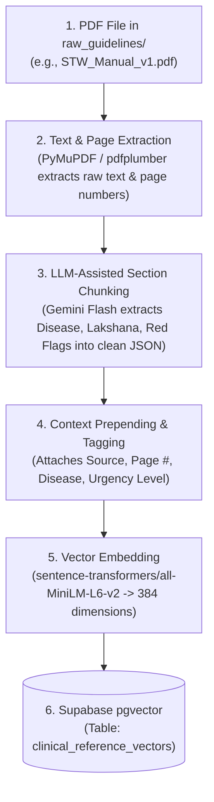

# MediKiosk — Clinical Knowledge & PDF Ingestion Pipeline Guide
## Complete Guide: Sourcing Official Guidelines, Smart Chunking, and Vector Embeddings for Collection 1

> **Project:** MediKiosk (SIH Problem Statement 26047 — Ministry of Ayush / AIIA)  
> **Target Audience:** RAG Engineers, Prompt Engineers, and ML Developers  
> **Scope:** How to source official government PDFs, parse them into structured clinical chunks, and store them as vector embeddings in Supabase `pgvector`.

---

## 1. Executive Summary & Objective

In MediKiosk, **Collection 1 (Clinical Reference)** is the static, authoritative knowledge base that grounds the AI case-taking interview. It ensures:
1. **Zero-Hallucination Ayurvedic Follow-up:** Grounded in CCRAS and Charaka Samhita clinical rubrics.
2. **Deterministic Emergency Triage:** High-risk symptom clusters (chest pain radiation, FAST stroke signs, Arishta Lakshana) immediately trigger red-flag escalation.
3. **Legal & Medical Provenance:** Every piece of clinical guidance retrieved is traceable to official government publications with page-level citations.

---

## 2. Official Source Directory & Download Links

Never scrape unstructured medical blogs or generic websites. Use only official government and institutional publications:

### 🏥 A. Allopathy & Emergency Triage (Government of India / Global)

| # | Document Title | Source Authority | Direct Download URL / Portal | What It Contains |
|---|---|---|---|---|
| **1** | **Standard Treatment Workflows (STW) of India: Volume 1 (2019)** | ICMR (Indian Council of Medical Research) | [Download PDF (15.4 MB)](https://www.icmr.gov.in/icmrobject/custom_data/pdf/downloadable-books/STW_Manual_v1.pdf) | Core primary care workflows (Cardiology, Respiratory, GI, Neurology, Diabetes) with explicit red flags & referral criteria. |
| **2** | **Standard Treatment Workflows (STW) of India: Volume 3 (2022)** | ICMR | [Download PDF (23 MB)](https://www.icmr.gov.in/icmrobject/custom_data/pdf/downloadable-books/STW_Vol_3_2022.pdf) | Updated specialty workflows for extended OPD presentations. |
| **3** | **ICMR STW Dedicated Portal** | ICMR / DHR | [https://stw.icmr.org.in](https://stw.icmr.org.in) | Searchable single-page workflows by clinical specialty. |
| **4** | **NICE Clinical Knowledge Summaries (CKS)** | NICE (UK) | [https://cks.nice.org.uk](https://cks.nice.org.uk) | Primary care symptom exploration trees and emergency red-flag symptom lists. |

---

### 🌿 B. Ayurveda & AYUSH Guidelines (Ministry of Ayush / CCRAS)

| # | Document Title | Source Authority | Direct Portal / Link | What It Contains |
|---|---|---|---|---|
| **1** | **Standard Treatment Guidelines in Ayurveda (STG) — Vol. 1 (Kayachikitsa)** | Ministry of Ayush / CCRAS | [Ministry of Ayush Guidelines](https://www.ayush.gov.in/) & [CCRAS Publications](https://ccras.nic.in/) | Top 35 general medicine conditions (*Sandhivata, Amlapitta, Grahani, Tamaka Shwasa, Jwara, Prameha*). |
| **2** | **CCRAS Prakriti Assessment Scale (PAS) Manual** | CCRAS | [CCRAS Ayur Prakriti Portal](http://ccras.res.in/ccras_pas/) | Validated 4-domain scoring criteria for baseline Vata/Pitta/Kapha assessment. |
| **3** | **e-Samhita Digital Classical Corpus** | NIIMH / CCRAS | [CCRAS e-Samhita](http://niimh.nic.in/ebooks/esamhiti/) | Digital Sanskrit/English references from Charaka Samhita, Sushruta Samhita, and Ashtanga Hridaya. |

---

### 🏷️ C. Morbidity Coding & Terminology (Collection 2)

| # | Dataset Title | Source Authority | Direct Portal / Link | What It Contains |
|---|---|---|---|---|
| **1** | **NAMASTE Morbidity Master Dataset** | Ministry of Ayush | [https://namaste.ayush.gov.in](https://namaste.ayush.gov.in) | 1,941 standardized AYUSH morbidity codes and clinical descriptions (CSV export). |

---

## 3. Project Directory Structure

Store downloaded raw PDFs in the dedicated guidelines folder:

```text
midiosk SIH hackathon/
├── backend/
│   ├── data/
│   │   ├── raw_guidelines/                   <--- Drop your downloaded PDFs here
│   │   │   ├── STW_Manual_v1.pdf
│   │   │   ├── STW_Vol_3_2022.pdf
│   │   │   ├── ayush_stg_kayachikitsa.pdf
│   │   │   └── namaste_morbidity_master.csv
│   │   └── processed_chunks/                 <--- Generated structured JSON chunks
│   └── app/
│       └── ai/
│           └── rag/
│               ├── ingest_guidelines.py      <--- Automated PDF-to-Vector script
│               ├── retriever.py              <--- Fast vector query function
│               └── supabase_clinical_setup.sql
```

---

## 4. How Raw PDFs are Converted to Vector Embeddings (The 5 Steps)



---

### Step 1: Text & Page Extraction (`PyMuPDF`)
The script iterates through the PDF page by page, tracking the exact page number for source citation:
```python
import fitz  # PyMuPDF

doc = fitz.open("backend/data/raw_guidelines/STW_Manual_v1.pdf")
for page_num in range(len(doc)):
    page = doc[page_num]
    text = page.get_text("text")
```

---

### Step 2: Smart Clinical Entity Chunking (LLM-Assisted)
Instead of arbitrary token splitting (which chops sentences mid-way), a fast, lightweight extraction model (Gemini 1.5 Flash / GPT-4o-mini) parses the raw page text into standardized clinical entities:

**Extraction Prompt Template:**
```text
You are an expert medical data structuring engine.
Extract clinical entities from the provided guideline text into a JSON list of chunks.

Each chunk must have:
- domain: "allopathy" | "ayurveda"
- category: "red_flag" | "symptoms" | "socrates_exploration" | "differential"
- title: Disease or Syndrome Name
- symptom_triggers: List of keywords/phrases a patient might say
- content: Clean, concise clinical reference text
- urgency_level: "CRITICAL" | "HIGH" | "ROUTINE"
```

---

### Step 3: Context Prepending & Metadata Enrichment
Each chunk receives a self-contained header and citation metadata:

```json
{
  "chunk_id": "allo_stw_v1_acs_mi_p42",
  "domain": "allopathy",
  "category": "red_flag",
  "title": "Acute Coronary Syndrome / Acute MI",
  "symptom_triggers": ["chest pain", "chest heaviness", "pain radiating to left arm", "sweating", "shortness of breath"],
  "content": "RED FLAG PROTOCOL: Acute Coronary Syndrome (ACS) / Myocardial Infarction.\n- Pathognomonic Features: Retrosternal pressure/crushing sensation, radiation to left arm, neck, or jaw, diaphoresis, dyspnea.\n- Emergency Action: Halt routine interview. Flag CRITICAL priority on doctor dashboard. Direct patient to emergency triage.",
  "metadata": {
    "source_document": "ICMR Standard Treatment Workflows of India (Vol 1, 2019)",
    "page_number": 42,
    "edition": "2019",
    "icd10_code": "I21.9"
  },
  "urgency_level": "CRITICAL"
}
```

---

### Step 4: Generating Vector Embeddings
We convert the text into mathematical coordinates (384-dimensional vector) using `all-MiniLM-L6-v2`:
```python
from sentence_transformers import SentenceTransformer

model = SentenceTransformer("sentence-transformers/all-MiniLM-L6-v2")
embedding = model.encode(chunk["content"], normalize_embeddings=True).tolist()
# Output: [0.0421, -0.1982, 0.5120, ..., -0.0831] (384 floats)
```

---

### Step 5: Storing in Supabase `pgvector`
The record is inserted into the PostgreSQL `clinical_reference_vectors` table:

```sql
INSERT INTO clinical_reference_vectors (
    chunk_id,
    domain,
    category,
    title,
    content,
    metadata,
    urgency_level,
    embedding
) VALUES (
    'allo_stw_v1_acs_mi_p42',
    'allopathy',
    'red_flag',
    'Acute Coronary Syndrome',
    '...content text...',
    '{"source": "ICMR STW Vol 1", "page": 42}'::jsonb,
    'CRITICAL',
    '[0.0421, -0.1982, ...]'::vector(384)
);
```

---

## 5. Supabase SQL Table Setup (`supabase_clinical_setup.sql`)

Run this SQL once in your Supabase SQL Editor:

```sql
-- 1. Enable pgvector extension
CREATE EXTENSION IF NOT EXISTS vector;

-- 2. Create the Clinical Reference Table (Collection 1)
CREATE TABLE IF NOT EXISTS clinical_reference_vectors (
    id UUID PRIMARY KEY DEFAULT gen_random_uuid(),
    chunk_id TEXT UNIQUE NOT NULL,
    domain TEXT NOT NULL,         -- 'allopathy' | 'ayurveda' | 'general'
    category TEXT NOT NULL,       -- 'red_flag' | 'symptoms' | 'socrates_exploration' | 'differential'
    title TEXT NOT NULL,
    content TEXT NOT NULL,
    metadata JSONB NOT NULL DEFAULT '{}'::jsonb,
    urgency_level TEXT DEFAULT 'ROUTINE',
    embedding VECTOR(384) NOT NULL,
    created_at TIMESTAMPTZ NOT NULL DEFAULT now()
);

-- 3. Create HNSW Vector Index for <5ms similarity queries
CREATE INDEX IF NOT EXISTS idx_clinical_ref_embedding_hnsw
ON clinical_reference_vectors
USING hnsw (embedding vector_cosine_ops);

-- 4. Create filtering indexes
CREATE INDEX IF NOT EXISTS idx_clinical_ref_domain ON clinical_reference_vectors(domain);
CREATE INDEX IF NOT EXISTS idx_clinical_ref_category ON clinical_reference_vectors(category);

-- 5. Create Fast Match RPC Function
CREATE OR REPLACE FUNCTION match_clinical_reference(
    p_query_embedding VECTOR(384),
    p_domain TEXT DEFAULT NULL,
    p_category TEXT DEFAULT NULL,
    p_top_k INT DEFAULT 3,
    p_similarity_threshold REAL DEFAULT 0.35
)
RETURNS TABLE (
    id UUID,
    chunk_id TEXT,
    domain TEXT,
    category TEXT,
    title TEXT,
    content TEXT,
    metadata JSONB,
    urgency_level TEXT,
    similarity REAL
)
LANGUAGE sql
AS $$
    SELECT
        c.id,
        c.chunk_id,
        c.domain,
        c.category,
        c.title,
        c.content,
        c.metadata,
        c.urgency_level,
        (1 - (c.embedding <=> p_query_embedding))::REAL AS similarity
    FROM clinical_reference_vectors c
    WHERE
        (p_domain IS NULL OR c.domain = p_domain)
        AND (p_category IS NULL OR c.category = p_category)
        AND (1 - (c.embedding <=> p_query_embedding)) >= p_similarity_threshold
    ORDER BY c.embedding <=> p_query_embedding ASC
    LIMIT p_top_k;
$$;
```

---

## 6. Real-Time Querying & Kiosk Handoff

During the patient interview, `retriever.py` calls the RPC function on every spoken turn:

```python
# In backend/app/ai/rag/retriever.py
async def retrieve_clinical_reference_async(
    query_text: str,
    domain: Optional[str] = None,
    top_k: int = 3
) -> List[Dict[str, Any]]:
    supabase = get_supabase_client()
    query_vector = generate_embedding(query_text)
    
    response = supabase.rpc("match_clinical_reference", {
        "p_query_embedding": query_vector,
        "p_domain": domain,
        "p_top_k": top_k,
        "p_similarity_threshold": 0.35
    }).execute()
    
    return response.data or []
```

### The Output Passed to Prompt Engineering:
```json
{
  "clinical_reference_chunks": [
    {
      "title": "Acute Coronary Syndrome",
      "content": "RED FLAG PROTOCOL: Acute Coronary Syndrome...",
      "source": "ICMR Standard Treatment Workflows Vol 1, Page 42",
      "urgency_level": "CRITICAL"
    }
  ]
}
```

---

## 7. Next Actions Checklist

- [x] Create `backend/data/raw_guidelines/` directory.
- [ ] Download `STW_Manual_v1.pdf` and `STW_Vol_3_2022.pdf` from the ICMR portal.
- [ ] Place downloaded PDFs in `backend/data/raw_guidelines/`.
- [ ] Execute `supabase_clinical_setup.sql` in the Supabase Dashboard.
- [ ] Run `python backend/app/ai/rag/ingest_guidelines.py` to batch embed and index the documents.
