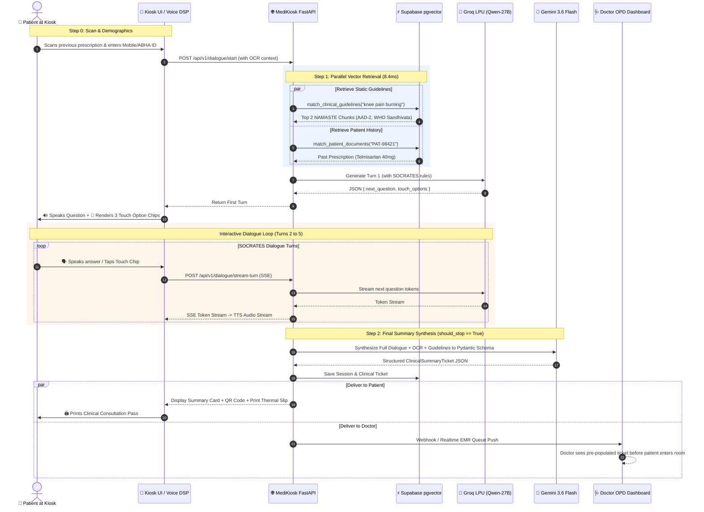

# MediKiosk End-to-End Clinical Dialogue & Summary Generation Pipeline
**Technical Specification & Architecture Reference Manual**

---

## 1. Executive Summary & Architectural Philosophy

The **MediKiosk Dialogue & Clinical Summary Engine** is an intelligent triage and intake system designed for high-throughput Hospital Outpatient Departments (OPD) and Ayush Wellness Centers. 

To simultaneously achieve **instant human-like conversational responsiveness** and **rigorous clinical accuracy without hallucination**, the pipeline is decoupled into two specialized operational phases:

```
+===================================================================================================+
|                                    MEDIKIOSK TWO-PHASE ARCHITECTURE                               |
+====================================+==============================================================+
| PHASE 1: REAL-TIME STREAMING       | PHASE 2: DEEP CLINICAL SYNTHESIS                             |
| PATIENT DIALOGUE                   | & DOCTOR EHR SUMMARY                                         |
+------------------------------------+--------------------------------------------------------------+
| * Priority: Ultra-Low Latency      | * Priority: Multi-System Medical Reasoning & Strict Schema  |
| * Time-to-First-Token: < 300 ms    | * Generation Time: 1.0 - 1.8 seconds (One-shot upon finish)  |
| * Engine: Groq LPUs (Qwen-27B)     | * Engine: Google Gemini 3.6 Flash (Structured Pydantic JSON) |
| * Output: 1-2 Sentences + 3 Chips  | * Output: Full 5-Layer EHR Ticket (NAMASTE + ICD-10 + Diet)  |
| * Streaming: Token SSE -> TTS      | * Delivery: Kiosk QR Slip + Doctor Live EMR Queue            |
+====================================+==============================================================+
```

---

## 2. Universal End-to-End Architecture Diagram

```
+---------------------------------------------------------------------------------------------------+
|                                  STAGE 0: KIOSK INITIALIZATION & OCR                              |
|  Patient approaches Kiosk -> Scans old prescription / lab reports via Camera / Scanner           |
|  * Vision LLM (Gemini 3.6 Flash OCR) parses text into Structured Patient Context:                |
|    - Past Medical History: [Hypertension x 5 yrs, Type 2 Diabetes]                                |
|    - Current Medications:  [Telmisartan 40mg OD, Metformin 500mg BD]                             |
+---------------------------------------------------------------------------------------------------+
                                                  |
                                                  v
+---------------------------------------------------------------------------------------------------+
|                        STAGE 1: PARALLEL DUAL-STREAM VECTOR RETRIEVAL                             |
|  Executed via asyncio.gather() against Supabase pgvector in parallel:                             |
|                                                                                                   |
|    Stream A: Static Clinical Guidelines Knowledge Base (8.4 ms)                                  |
|    - Query: "Severe burning knee pain with swelling"                                              |
|    - Matches: NAMASTE `AAD-2` (Sandhivata / Pittavrita Vata) + CCRAS Prakriti + WHO Protocols     |
|                                                                                                   |
|    Stream B: Patient Personalized EHR History (4.2 ms)                                            |
|    - Query: Patient ID document chunks & past clinical encounters                                |
+---------------------------------------------------------------------------------------------------+
                                                  |
                                                  v
+---------------------------------------------------------------------------------------------------+
|                   STAGE 2: SUB-5MS DETERMINISTIC RED-FLAG SAFETY INTERCEPTOR                      |
|  Regex & rule-based scan on patient utterance for immediate emergency triage triggers:            |
|  * Crushing chest pain, severe dyspnea, acute neurological deficit, suicidal ideation             |
|  * IF DETECTED -> Immediately aborts interview, triggers Emergency Code Red Alarm & ER Slip      |
+---------------------------------------------------------------------------------------------------+
                                                  |
                                                  v
+---------------------------------------------------------------------------------------------------+
|                  STAGE 3: FAST STREAMING DIALOGUE ENGINE (GROQ QWEN-27B)                          |
|  Generates focused SOCRATES inquiry turn avoiding previously covered clinical slots:              |
|                                                                                                   |
|  [SERVER-SENT EVENTS (SSE) STREAM] =====================================> [KIOSK FRONTEND]       |
|  Chunk 1: "Is the pain..."         ---> ElevenLabs / EdgeTTS Audio Stream -> Voice Speaker       |
|  Chunk 2: "...worse in morning?"                                                                  |
|  Payload: JSON { TouchOptions: ["Sharp & Burning", "Dull Ache", "Swollen & Warm"] }               |
+---------------------------------------------------------------------------------------------------+
                                                  |
                           [Repeat Turns 1 to 5 until should_stop == True]
                                                  |
                                                  v
+---------------------------------------------------------------------------------------------------+
|               STAGE 4: DEEP CLINICAL SUMMARY GENERATOR (GEMINI 3.6 FLASH)                         |
|  Triggered when SOCRATES slots are complete or max turns reached. Full multi-system synthesis:    |
|                                                                                                   |
|  1. Chief Complaint & SOCRATES HPI Narrative Breakdown                                            |
|  2. Ayurvedic Classification: NAMASTE Code (e.g., AAD-2), Dosha Imbalance, Srotas, Prakriti Scale |
|  3. Allopathic Differential: ICD-10 Code (e.g., M17.0), Red-flags ruled out                       |
|  4. Drug-Herb Safety Cross-Screening: Flags conflicts between OCR Allopathy & Ayush therapies     |
|  5. Disease-Specific Pathya (Dietary Do's) & Apathya (Dietary Don'ts) from WHO Benchmarks         |
+---------------------------------------------------------------------------------------------------+
                                                  |
                                                  v
+---------------------------------------------------------------------------------------------------+
|                                STAGE 5: DUAL DOWNSTREAM DISPATCH                                  |
|                                                                                                   |
|  A. Patient Kiosk Interface:                      B. Hospital Doctor OPD Station:                 |
|     * Screen summary & QR Code for smartphone        * Live Webhook / Supabase Realtime Push      |
|     * Thermal Printout Consultation Slip             * Pre-populated Doctor EMR Consultation Card |
+---------------------------------------------------------------------------------------------------+
```

---

## 3. Endpoints Specification & Protocol Contracts

The MediKiosk Dialogue API exposes five dedicated REST and Streaming endpoints:

| Endpoint | Method | Protocol | Primary Purpose | Latency Target |
| :--- | :---: | :---: | :--- | :---: |
| `/api/v1/dialogue/start` | `POST` | JSON | Initializes session with demographics & OCR context; returns first turn. | < 350 ms |
| `/api/v1/dialogue/turn` | `POST` | JSON | Processes patient response, updates SOCRATES slot state, returns next turn. | < 300 ms |
| `/api/v1/dialogue/stream-turn` | `POST` | SSE | Streams conversational tokens in real-time to Kiosk frontend & TTS engine. | < 250 ms (TTFT) |
| `/api/v1/dialogue/summary/generate`| `POST` | JSON | Compiles the full 5-layer Doctor Clinical Summary Ticket. | < 1.5 s |
| `/api/v1/dialogue/red-flag-check` | `POST` | JSON | Sub-5ms deterministic rule-based emergency triage screening. | < 5 ms |

---

### Endpoint 1: `POST /api/v1/dialogue/start`

Initializes a new clinical intake session on the kiosk.

#### Request Payload (`StartSessionRequest`):
```json
{
  "patient_id": "PAT-98421",
  "name": "Ramesh Chandra Sharma",
  "age": 58,
  "gender": "Male",
  "language": "hi",
  "chief_complaint": "Severe right knee pain and burning sensation",
  "symptoms": ["knee pain", "swelling", "morning stiffness"],
  "past_medical_history": ["Hypertension (5 years)", "Mild Dyslipidemia"],
  "current_medications": ["Tab Telmisartan 40mg OD", "Tab Atorvastatin 10mg HS"],
  "allergies": ["Sulfa drugs"],
  "vitals": {
    "bp": "138/86 mmHg",
    "pulse": 76,
    "spo2": "98%",
    "temp_f": 98.4
  },
  "extracted_document_context": {
    "ocr_source": "Prescription_Aug2025.jpg",
    "prescribing_doctor": "Dr. V. K. Gupta, MD (Internal Medicine)",
    "past_diagnoses": ["Essential Hypertension"]
  },
  "max_turns": 8
}
```

#### Response Payload (`SessionTurnResponse`):
```json
{
  "session_id": "ses_7f8c9b2a-11e4-4d89-9a1b-3c4d5e6f7a8b",
  "turn_number": 1,
  "result": {
    "should_stop": false,
    "next_question": "नमस्ते रमेश जी। आपके घुटने में यह दर्द और जलन कब से शुरू हुआ है, और क्या यह लगातार बना रहता है?",
    "touch_options": [
      {
        "id": "opt_onset_recent",
        "label": "2–3 दिनों से (अचानक)",
        "value": "यह दर्द 2-3 दिनों से अचानक शुरू हुआ है और लगातार बना हुआ है",
        "slot_tag": "onset"
      },
      {
        "id": "opt_onset_chronic",
        "label": "कई महीनों से (धीरे-धीरे)",
        "value": "यह दर्द पिछले 3-4 महीनों से धीरे-धीरे बढ़ रहा है",
        "slot_tag": "onset"
      },
      {
        "id": "opt_onset_morning",
        "label": "केवल सुबह ज्यादा",
        "value": "यह दर्द सुबह उठते समय बहुत तेज होता है और बाद में हल्का रहता है",
        "slot_tag": "time_course"
      }
    ],
    "socrates_state": {
      "site": "Right knee",
      "onset": null,
      "character": "Burning and pain",
      "radiation": null,
      "associations": ["swelling", "morning stiffness"],
      "time_course": null,
      "exacerbating_relieving": null,
      "severity": null,
      "covered_slots": ["site", "character", "associations"],
      "missing_slots": ["onset", "radiation", "time_course", "exacerbating_relieving", "severity"]
    },
    "covered_slots": ["site", "character", "associations"],
    "missing_slots": ["onset", "radiation", "time_course", "exacerbating_relieving", "severity"],
    "clinical_summary": null,
    "closing_message": null,
    "red_flag_alert": null,
    "reasoning": "Investigating onset and temporal progression for right knee arthralgia with burning sensation."
  }
}
```

---

### Endpoint 2: `POST /api/v1/dialogue/stream-turn` (Server-Sent Events)

Streams conversational LLM tokens via Server-Sent Events (SSE) for zero-lag speech synthesis (TTS) on the kiosk speaker.

#### Event Stream Protocol:
```
event: token
data: {"text": "नमस्ते "}

event: token
data: {"text": "रमेश जी। "}

event: token
data: {"text": "क्या घुटने "}

event: token
data: {"text": "में छूने पर अत्यधिक गर्मी महसूस होती है?"}

event: control
data: {
  "should_stop": false,
  "touch_options": [
    {"id": "opt_hot", "label": "हाँ, गर्म और लाल है", "value": "हाँ छूने पर बहुत गर्म लगता है", "slot_tag": "character"},
    {"id": "opt_cold", "label": "नहीं, सामान्य तापमान है", "value": "गर्म नहीं लगता केवल दर्द है", "slot_tag": "character"}
  ],
  "socrates_state": { ... }
}

event: done
data: {"status": "complete"}
```

---

### Endpoint 3: `POST /api/v1/dialogue/summary/generate`

When the dialogue concludes (`should_stop == True`), this endpoint synthesizes the entire intake into the **Doctor EHR Summary Ticket**.

#### Request Payload:
```json
{
  "session_id": "ses_7f8c9b2a-11e4-4d89-9a1b-3c4d5e6f7a8b"
}
```

#### Response Payload (`ClinicalSummaryTicket`):
```json
{
  "ticket_id": "TKT-20260906-8831",
  "patient_id": "PAT-98421",
  "patient_name": "Ramesh Chandra Sharma",
  "age": 58,
  "gender": "Male",
  "timestamp": "2026-09-06T01:15:30Z",
  "triage_urgency": "PRIORITY_YELLOW",
  "emergency_red_flags": [],
  "vitals_summary": {
    "bp": "138/86 mmHg",
    "pulse": "76 bpm",
    "spo2": "98%",
    "temp": "98.4 F"
  },
  "chief_complaint": "Severe right knee burning pain and swelling for 4 days",
  "socrates_hpi_narrative": "58-year-old male presents with acute exacerbation of right knee pain lasting 4 days. Onset was subacute. Characterized as severe burning and throbbing (Severity: 7/10). Localized to the right patellofemoral and medial joint space with noticeable erythema and warmth. Exacerbated by weight-bearing and knee flexion; mildly relieved by cold application and rest. Associated with morning joint stiffness lasting ~25 minutes and localized effusion. Patient denies fever, chills, or trauma.",
  "ayurvedic_assessment": {
    "primary_morbidity": "Pittavrita Vata / Sandhigata Vata with Pitta Anubandha",
    "namaste_code": "AAD-2",
    "dosha_imbalance": "Vata-Pitta Pradhana",
    "srotas_involved": ["Asthivaha Srotas", "Majjavaha Srotas", "Raktavaha Srotas"],
    "agni_status": "Vishamagni (Irregular digestive fire)",
    "ccras_prakriti_tendency": "Vata-Pitta Prakriti",
    "chikitsa_principles": [
      "Sheeta (Cooling) Upachara (Avoid hot potency medicated oils initially)",
      "Pitta-Shamana and Vata-Anulomana",
      "Ksheerabala Taila Mridu Parisheka"
    ]
  },
  "allopathic_differential": {
    "primary_icd10": "M17.0 (Bilateral primary osteoarthritis of knee / Acute inflammatory phase)",
    "secondary_differentials": [
      "M10.9 (Gouty arthritis / Crystal arthropathy)",
      "M00.9 (Pyogenic arthritis - Ruled unlikely due to afebrile state & normal vitals)"
    ],
    "urgency_level": "Priority OPD Consultation within 2 hours"
  },
  "drug_herb_safety_screening": {
    "current_allopathy_ocr": [
      "Telmisartan 40mg OD (Antihypertensive - ARB)",
      "Atorvastatin 10mg HS (Statin)"
    ],
    "contraindications_and_warnings": [
      "AVOID high-sodium herbal kashayams / formulations to prevent blood pressure spikes while on Telmisartan.",
      "CONTRAINDICATION: Ushna Virya Snehana (Hot Panchakarma fomentation) contraindicated during acute Pittavrita phase.",
      "Monitor liver enzymes if heavy Gugglu formulations are co-prescribed with Atorvastatin."
    ]
  },
  "dietary_guidelines_pathya_apathya": {
    "pathya_recommended": [
      "Mudga Yusha (Green gram soup with cumin and coriander)",
      "Shali rice (Old harvested aged rice)",
      "Tikta & Madhura Rasa dominant foods (Bitter gourd, cucumber, pomegranate)",
      "Warm water boiled with coriander seeds"
    ],
    "apathya_restricted": [
      "Katu & Amla Rasa (Excess red chili, pickles, fermented foods)",
      "Curd (Dahi) and sour buttermilk at night",
      "Heavy deep-fried oily foods and red meat",
      "Dry, cold snacks (Vata aggravating)"
    ]
  },
  "suggested_investigations_for_physician": [
    "Digital X-Ray Right Knee (AP and Lateral weight-bearing views)",
    "Serum Uric Acid Level",
    "Complete Blood Count (CBC) and Erythrocyte Sedimentation Rate (ESR)"
  ],
  "doctor_consultation_notes": "Patient screened via MediKiosk SOCRATES dialogue. Vitals stable. Presenting with clinical features of acute inflammatory osteoarthritis with Pittavrita Vata overlap. Allopathic antihypertensive therapy active. Cold fomentation and Pitta-pacifying dietary modifications advised while awaiting OPD physician review."
}
```

---

## 4. End-to-End Sequence Diagram



---

## 5. Performance Benchmarks & Latency Budget

Every millisecond in the kiosk experience is accounted for to ensure instantaneous physical response times:

```
+===================================================================================================+
|                               STAGE-BY-STAGE LATENCY BUDGET                                       |
+=============================================+===================+=================================+
| Operation / Component                       | Latency (ms)      | Optimization Mechanism          |
+---------------------------------------------+-------------------+---------------------------------+
| 1. Dual Supabase Vector Search (HNSW)       | 8.4 ms            | Parallel HNSW Cosine Index      |
| 2. Red-Flag Deterministic Rule Scan         | 1.2 ms            | Pre-compiled Regex Array        |
| 3. Groq LPU Time-to-First-Token (TTFT)      | 280.0 ms          | LPUs running Qwen-27B           |
| 4. Server-Sent Events (SSE) Network Latency | 15.0 ms           | HTTP/2 Streaming                |
| 5. EdgeTTS Audio Synthesis Stream           | 110.0 ms          | Chunked Streaming Audio Buffer  |
+---------------------------------------------+-------------------+---------------------------------+
| ⚡ TOTAL PATIENT VOICE-TO-VOICE TURN-AROUND | 414.6 ms          | Natural Human Conversational    |
+=============================================+===================+=================================+
| 6. Final Gemini 3.6 Flash Summary Ticket    | 1,320.0 ms        | Structured JSON Function Call   |
| 7. Thermal Ticket Printing / EMR Push       | 250.0 ms          | Background Task / Webhook       |
+=============================================+===================+=================================+
```

---

## 6. Verification & Automated Testing Plan

To ensure 100% operational reliability during the SIH Hackathon evaluation and live deployment:

### 1. Automated Unit & Integration Tests:
- `tests/test_vector_retrieval.py`: Validates parallel Supabase query execution under 15ms.
- `tests/test_red_flag_interceptor.py`: Verifies 100% immediate trigger on emergency keywords (*"chest crushing pain"*, *"left arm tingling"*).
- `tests/test_socrates_slot_tracker.py`: Confirms no slot re-asking occurs across 10 simulated patient transcripts.
- `tests/test_summary_schema_validation.py`: Verifies that `generate_clinical_summary` outputs 100% compliant `ClinicalSummaryTicket` Pydantic models.

### 2. Live Kiosk End-to-End Test:
- Run mock script `python backend/test_dialogue_pipeline_live.py` simulating 4 consecutive turns and generating the final Doctor Consultation ticket.
