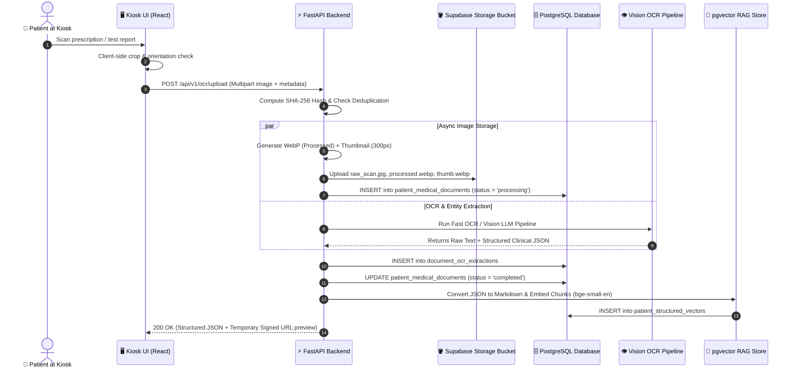

# 📄 MediKiosk Raw OCR Image & Document Storage Architecture

> **Document Version:** 1.0  
> **Target System:** MediKiosk AI Clinical Intake & Prescription OCR Platform  
> **Primary Scope:** Storage Strategy, Database Schema, and Security Lifecycle for Raw Medical Scans, Prescriptions, and Lab Images  

---

## 📌 1. Executive Summary & Core Architectural Principle

During hospital intake, patients scan physical prescriptions, lab test reports, discharge summaries, and prior Ayurvedic treatment papers using the kiosk camera or touchscreen upload. 

### ⚠️ The Golden Rule of Medical Document Storage:
> **Never store binary image data (BYTEA or Base64) directly inside PostgreSQL relational tables.**  
> Storing large binary images in database tables causes rapid table bloat, degrades database buffer cache performance, slows down backups/replication, and severely impacts query latency.

### 🏛️ The Chosen 3-Tier Storage Architecture:
MediKiosk adopts an enterprise-grade **3-Tier Storage Architecture**:

1. **Object Storage Tier (Binary Blob Store):** Stores the high-resolution original image scan, optimized WebP versions, and thumbnail previews in private, encrypted object buckets.
2. **Relational Database Tier (PostgreSQL / Supabase):** Stores structured document metadata, storage paths, deduplication SHA-256 hashes, OCR processing statuses, and extracted clinical JSON.
3. **Vector Database Tier (`pgvector`):** Stores semantic markdown chunks and embeddings of extracted document entities (medications, diagnoses, abnormal lab values) for cross-visit RAG retrieval.

---

## 🏗️ 2. Storage Tier Selection & Comparison

| Storage Provider | Deployment Scenario | Key Advantages | Trade-offs / Considerations | Recommended For |
|---|---|---|---|---|
| **Supabase Storage** *(Primary)* | Cloud / Hybrid Hospital Deployment | • Direct integration with Supabase Auth & PostgreSQL RLS<br>• Automated signed URL generation<br>• S3-compatible API under the hood | • Dependent on Supabase cloud limits or self-hosted Supabase instance | **Standard MediKiosk Cloud Deployment** |
| **MinIO (Self-Hosted S3)** | On-Premises / Offline Kiosk Edge | • 100% data sovereignty (data stays within hospital LAN)<br>• S3 API compatible<br>• Zero cloud egress cost | • Requires local server maintenance & backup configuration | **Air-Gapped / Strict Ayush Hospital Intranets** |
| **AWS S3 / Cloudflare R2** | Large-Scale Multi-Hospital Network | • Industry-standard durability (99.999999999%)<br>• Cloudflare R2 offers zero-egress fees<br>• Fine-grained IAM policies | • Requires managing separate AWS credentials and access keys | **State / National-Level Health Networks** |

---

## 📁 3. Storage Bucket Hierarchy & File Naming Conventions

All documents are stored in a dedicated **private bucket** named `patient-medical-records`. Files are organized into an immutable, hierarchical directory structure indexed by patient and encounter date:

```
patient-medical-records/
└── {patient_id}/                           # e.g., PAT-DEMO-4821 or ABHA ID
    └── {document_type}/                    # 'prescriptions', 'lab_reports', 'discharge_summaries', 'ayurvedic_records'
        └── {year}/{month}/
            ├── {doc_uuid}_raw.jpg          # Original uncompressed camera capture (archival)
            ├── {doc_uuid}_processed.webp   # Deskewed, normalized & contrast-enhanced image used for OCR
            └── {doc_uuid}_thumb.webp       # 300px lightweight thumbnail for Doctor Dashboard UI
```

### File Naming Convention:
* `doc_uuid`: Unique UUIDv4 assigned at upload time (e.g., `d8f3b2a1-6c4e-4f11-9a7b-8e2d4c6a1b3f`).
* Format extensions:
  * Raw archival: `.jpg` / `.png` / `.pdf`
  * Processed OCR input: `.webp` (Q=90, optimized for OCR contrast)
  * UI Preview: `.webp` (Q=75, max width 400px)

---

## 🗄️ 4. Master Database Schema Design (PostgreSQL / Supabase DDL)

To track every uploaded document, its file path, processing lifecycle, and extracted clinical findings, execute the following schema in Supabase:

```sql
-- ==============================================================================
-- 1. Medical Documents Registry Table (Metadata & Storage Pointers)
-- ==============================================================================
CREATE TABLE IF NOT EXISTS patient_medical_documents (
    id UUID PRIMARY KEY DEFAULT gen_random_uuid(),
    patient_id TEXT NOT NULL REFERENCES patients(id) ON DELETE CASCADE,
    session_id TEXT REFERENCES dialogue_sessions(id) ON DELETE SET NULL,
    
    -- Document Categorization
    document_type TEXT NOT NULL DEFAULT 'prescription', 
    -- 'prescription', 'lab_report', 'discharge_summary', 'ayurvedic_record', 'other'
    
    -- Storage Bucket & File Pointers
    storage_bucket TEXT NOT NULL DEFAULT 'patient-medical-records',
    file_path_raw TEXT NOT NULL,         -- Path to original image in bucket
    file_path_processed TEXT,            -- Path to preprocessed/deskewed image
    file_path_thumbnail TEXT,            -- Path to quick-loading UI thumbnail
    
    -- Technical Metadata
    mime_type TEXT NOT NULL,             -- 'image/jpeg', 'image/png', 'application/pdf'
    file_size_bytes BIGINT NOT NULL,
    file_hash_sha256 TEXT NOT NULL,      -- Forensic deduplication & tamper verification
    page_count INT NOT NULL DEFAULT 1,
    
    -- Processing Pipeline Lifecycle
    ocr_status TEXT NOT NULL DEFAULT 'pending', 
    -- 'pending', 'processing', 'completed', 'failed', 'quality_rejected'
    ocr_engine_used TEXT,                -- 'paddle_ocr', 'vision_llm_qwen2_vl', 'hybrid'
    quality_score FLOAT,                 -- Image blurriness & readability score (0.0 - 1.0)
    
    -- Doctor Review & Validation
    is_reviewed_by_doctor BOOLEAN NOT NULL DEFAULT FALSE,
    reviewed_by_doctor_id TEXT,
    doctor_notes TEXT,
    
    -- Timestamps
    created_at TIMESTAMPTZ NOT NULL DEFAULT now(),
    processed_at TIMESTAMPTZ,
    updated_at TIMESTAMPTZ NOT NULL DEFAULT now()
);

-- ==============================================================================
-- 2. Document OCR Extracted Clinical Data Table
-- ==============================================================================
CREATE TABLE IF NOT EXISTS document_ocr_extractions (
    id UUID PRIMARY KEY DEFAULT gen_random_uuid(),
    document_id UUID NOT NULL REFERENCES patient_medical_documents(id) ON DELETE CASCADE,
    patient_id TEXT NOT NULL REFERENCES patients(id) ON DELETE CASCADE,
    
    -- Raw OCR Output
    raw_extracted_text TEXT NOT NULL,
    
    -- Structured Clinical JSON (Extracted by Vision LLM / Pipeline)
    structured_data JSONB NOT NULL DEFAULT '{}'::jsonb,
    /* Example JSONB Payload:
       {
         "hospital_name": "AIIMS New Delhi",
         "date_of_consultation": "2026-08-15",
         "doctor_name": "Dr. Sharma",
         "medications": [
           {"name": "Metformin", "dosage": "500mg", "frequency": "1-0-1", "duration": "30 days"},
           {"name": "Telmisartan", "dosage": "40mg", "frequency": "1-0-0", "duration": "Ongoing"}
         ],
         "diagnoses": ["Type 2 Diabetes Mellitus", "Essential Hypertension"],
         "lab_findings": [
           {"test": "HbA1c", "value": "7.8", "unit": "%", "status": "high"},
           {"test": "Serum Creatinine", "value": "0.9", "unit": "mg/dL", "status": "normal"}
         ],
         "ayush_parameters": {
           "prakriti_notes": "Pitta dominant",
           "formulations": ["Chandraprabha Vati", "Triphala Churna"]
         }
       }
    */
    
    -- Confidence & Validation
    confidence_score FLOAT DEFAULT 0.95,
    abnormal_flags_detected JSONB DEFAULT '[]'::jsonb,
    
    created_at TIMESTAMPTZ NOT NULL DEFAULT now()
);

-- ==============================================================================
-- 3. Storage & Relational Query Indexes
-- ==============================================================================
CREATE INDEX IF NOT EXISTS idx_med_docs_patient ON patient_medical_documents (patient_id);
CREATE INDEX IF NOT EXISTS idx_med_docs_hash ON patient_medical_documents (file_hash_sha256);
CREATE INDEX IF NOT EXISTS idx_med_docs_status ON patient_medical_documents (ocr_status);
CREATE INDEX IF NOT EXISTS idx_ocr_extract_doc ON document_ocr_extractions (document_id);
CREATE INDEX IF NOT EXISTS idx_ocr_extract_patient ON document_ocr_extractions (patient_id);
```

---

## 🔄 5. End-to-End Ingestion & Processing Pipeline Flow



---

## 🔒 6. Security, Privacy & ABDM / HIPAA Compliance

Because medical documents contain Sensitive Personal Data (SPD / PHI):

1. **Private Bucket by Default:**
   * The `patient-medical-records` bucket is strictly private. Public URL access is disabled.
2. **Short-Lived Presigned URLs:**
   * When the Doctor Dashboard requests an image scan for verification, FastAPI generates a **time-limited Signed URL (15 minutes expiry)** using the Supabase Storage SDK.
3. **Encryption-at-Rest & in-Transit:**
   * All images stored in the bucket are encrypted using AES-256 (SSE-S3).
   * All network transfers occur over TLS 1.3.
4. **SHA-256 Cryptographic Deduplication:**
   * Before uploading, the backend calculates the SHA-256 checksum of the file bytes. If the same physical prescription is scanned twice in the same visit, the system links the existing record rather than wasting storage space.
5. **Row-Level Security (RLS) Policy Example:**

```sql
-- Ensure only authenticated doctors and assigned kiosks can read patient documents
ALTER TABLE patient_medical_documents ENABLE ROW LEVEL SECURITY;

CREATE POLICY "Allow medical staff to view documents"
ON patient_medical_documents
FOR SELECT
USING (auth.role() = 'authenticated');
```

---

## 💻 7. FastAPI Backend Implementation Blueprint

Here is the reference Python implementation for uploading raw images, creating thumbnails, storing them in Supabase Storage, and saving metadata:

```python
# backend/app/ai/ocr/storage_service.py
import hashlib
import io
import uuid
from datetime import datetime
from typing import Dict, Any, Tuple
from PIL import Image
from app.db import get_supabase_client

BUCKET_NAME = "patient-medical-records"

def compute_sha256(file_bytes: bytes) -> str:
    """Calculates SHA-256 hash for forensic integrity and deduplication."""
    return hashlib.sha256(file_bytes).hexdigest()

def create_optimized_images(raw_bytes: bytes) -> Tuple[bytes, bytes]:
    """
    Creates an OCR-optimized WebP image and a lightweight thumbnail.
    """
    with Image.open(io.BytesIO(raw_bytes)) as img:
        # Convert RGBA/Palette to RGB
        if img.mode in ("RGBA", "P"):
            img = img.convert("RGB")

        # 1. OCR Processed Image (Max 2048px width, WebP Q=88)
        processed_img = img.copy()
        processed_img.thumbnail((2048, 2048), Image.Resampling.LANCZOS)
        proc_buf = io.BytesIO()
        processed_img.save(proc_buf, format="WEBP", quality=88)
        processed_bytes = proc_buf.getvalue()

        # 2. UI Thumbnail (Max 400px width, WebP Q=75)
        thumb_img = img.copy()
        thumb_img.thumbnail((400, 400), Image.Resampling.LANCZOS)
        thumb_buf = io.BytesIO()
        thumb_img.save(thumb_buf, format="WEBP", quality=75)
        thumb_bytes = thumb_buf.getvalue()

    return processed_bytes, thumb_bytes

async def upload_and_register_document(
    patient_id: str,
    raw_file_bytes: bytes,
    original_filename: str,
    document_type: str = "prescription",
    session_id: str = None
) -> Dict[str, Any]:
    """
    1. Generates file hierarchy.
    2. Uploads raw, processed, and thumbnail images to Supabase Storage.
    3. Inserts document record into PostgreSQL.
    """
    supabase = get_supabase_client()
    doc_id = str(uuid.uuid4())
    now = datetime.utcnow()
    year_month = now.strftime("%Y/%m")
    
    file_hash = compute_sha256(raw_file_bytes)
    proc_bytes, thumb_bytes = create_optimized_images(raw_file_bytes)
    
    # Storage file paths
    raw_path = f"{patient_id}/{document_type}/{year_month}/{doc_id}_raw.jpg"
    proc_path = f"{patient_id}/{document_type}/{year_month}/{doc_id}_processed.webp"
    thumb_path = f"{patient_id}/{document_type}/{year_month}/{doc_id}_thumb.webp"
    
    # 1. Upload to Supabase Storage Bucket
    supabase.storage.from_(BUCKET_NAME).upload(raw_path, raw_file_bytes, {"content-type": "image/jpeg"})
    supabase.storage.from_(BUCKET_NAME).upload(proc_path, proc_bytes, {"content-type": "image/webp"})
    supabase.storage.from_(BUCKET_NAME).upload(thumb_path, thumb_bytes, {"content-type": "image/webp"})
    
    # 2. Insert metadata record in PostgreSQL
    doc_record = {
        "id": doc_id,
        "patient_id": patient_id,
        "session_id": session_id,
        "document_type": document_type,
        "storage_bucket": BUCKET_NAME,
        "file_path_raw": raw_path,
        "file_path_processed": proc_path,
        "file_path_thumbnail": thumb_path,
        "mime_type": "image/jpeg",
        "file_size_bytes": len(raw_file_bytes),
        "file_hash_sha256": file_hash,
        "ocr_status": "pending"
    }
    
    res = supabase.table("patient_medical_documents").insert(doc_record).execute()
    return res.data[0] if res.data else doc_record

def generate_signed_document_url(file_path: str, expires_in_seconds: int = 900) -> str:
    """Generates a secure 15-minute temporary signed viewing URL for doctors."""
    supabase = get_supabase_client()
    res = supabase.storage.from_(BUCKET_NAME).create_signed_url(file_path, expires_in_seconds)
    return res.get("signedURL") or res.get("signedUrl", "")
```

---

## 🎯 8. Summary Checklist for Implementation

- [x] **Storage Strategy:** Dual-tier architecture (Supabase Storage for raw files + Postgres for metadata & extracted JSON + `pgvector` for RAG).
- [x] **Private Bucket:** `patient-medical-records` configured with RLS and private ACLs.
- [x] **Image Preprocessing:** High-res camera photos compressed into optimized WebP and thumbnails before long-term storage.
- [x] **Security & Integrity:** SHA-256 deduplication and 15-minute temporary signed URLs for doctor viewing.
