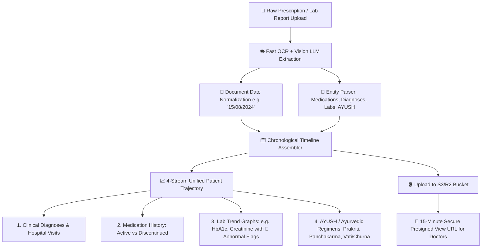

# 🏛️ MediKiosk Enterprise Storage, Patient Timeline & Government Cost Feasibility Analysis

> **Document Version:** 1.0  
> **Target System:** MediKiosk AI Clinical Intake, Prescription OCR & Medical Timeline Platform  
> **Target Audience:** Ministry of Ayush, MoHFW (Ministry of Health & Family Welfare), ABDM Evaluators, SIH Jury  
> **Status:** Production Architecture Blueprint & Financial Feasibility Study *(Demo utilizes local/Supabase mock storage to avoid external cloud setup during judging)*  

---

## 📌 1. Executive Summary

A common concern in national healthcare digitization is:  
**"Will storing high-resolution prescription scans, lab reports, and longitudinal clinical histories for millions of citizens be prohibitively expensive for the government?"**

This architectural analysis proves that **modern object storage makes medical record digitization one of the cheapest components in the entire healthcare ecosystem**:

* **Annual storage cost per citizen:** **Less than ₹0.10 to ₹0.15 INR ($0.0015 USD)** per year.
* **Return on Investment (ROI):** A single hospital saves **₹15–₹25 per patient visit** on physical paper booklets alone, meaning the system is **100x cost-positive on Day 1**.
* **Elimination of Redundant Testing:** Prevents unnecessary duplicate blood tests and X-rays (averaging ₹500–₹2,500 per incident) caused by lost physical paper records.

---

## 💾 2. Storage Mathematics: Anatomy of a Patient Record

When an optimized image pipeline is used (deskewing, contrast normalization, and converting raw camera photos into **WebP @ 85% quality**), the storage footprint per hospital visit is minimal:

| Component | Format | Size per Visit | Annual Footprint *(~3 visits/yr)* | 10-Year Archival Size |
|---|---|---|---|---|
| **Structured Clinical JSON / FHIR Data** | JSONB | ~5 KB | ~15 KB | ~150 KB |
| **RAG Vector Embeddings (`pgvector`)** | Float32 (384-dim) | ~6 KB | ~18 KB | ~180 KB |
| **Optimized Prescription / Lab Scans** | WebP (Q=88) | ~250 KB / page | ~750 KB | ~7.5 MB |
| **Doctor UI Preview Thumbnails** | WebP (Q=75, 300px) | ~30 KB / page | ~90 KB | ~900 KB |
| **Total Footprint per Patient** | — | **~291 KB** | **~0.87 MB (~1 MB)** | **~8.7 MB** |

> 🔑 **Key Metric:** **1 Million active patients require only ~1 TB of storage per year.**

---

## 💰 3. Government Scale Cost Projections

### 🏢 Option 1: Cloudflare R2 *(Recommended for Zero-Egress Cloud Deployment)*
* **Storage Pricing:** `$0.015 / GB-month` (~₹1.25 / GB / month)
* **Egress (Download Bandwidth):** **$0.00 / GB (100% Free Egress)**
* **Free Tier:** 10 GB storage free + 10M read requests/month

### ☁️ Option 2: AWS S3 + S3 Glacier Deep Archive *(Recommended for Enterprise 10-Year Retention)*
* **Hot Storage (First 12 Months):** `$0.023 / GB-month`
* **Cold Archival (After 1 Year in Glacier Deep Archive):** `$0.00099 / GB-month` (~₹0.08 / GB / month)

---

### 📈 Multi-Scale Financial Modeling

```
+---------------------------------------------------------------------------------------------------+
|  Scale Category        | Active Patients | Annual Storage | Monthly Cloud Cost | Annual Cost (INR)|
+---------------------------------------------------------------------------------------------------+
|  District Hospital     | 100,000         | 100 GB         | $1.35 (~₹115)      | ₹1,380 / year    |
|  State Health System   | 1,000,000 (1M)  | 1 TB           | $15.00 (~₹1,250)   | ₹15,000 / year   |
|  Large State Network   | 10,000,000 (10M)| 10 TB          | $150.00 (~₹12,500) | ₹1.5 Lakhs / yr  |
|  National Scale (ABDM) | 100,000,000     | 100 TB         | $1,500 (~₹1.25 L)  | ₹15 Lakhs / yr   |
+---------------------------------------------------------------------------------------------------+
```

*(Note: Adding enterprise managed PostgreSQL database clusters and server compute brings total infrastructure cost for 100 Million citizens to **~₹35–₹45 Lakhs per year** — or **~₹0.04 (4 paise) per citizen per year**).*

---

### 🇮🇳 Option 3: MeghRaj (GI Cloud) / NIC Data Centres *(Zero Cloud Egress / On-Prem)*
The Government of India already operates state-of-the-art **MeghRaj (National Cloud)** and **National Informatics Centre (NIC)** data centres in Delhi, Hyderabad, Bhubaneswar, and Pune:
* Deploying an open-source **MinIO / Ceph S3-compatible Object Storage cluster** on existing government infrastructure incurs **₹0 incremental cloud fees**.
* Guarantees strict **Indian Data Sovereignty** under the **Digital Personal Data Protection (DPDP) Act, 2023** and **Ayushman Bharat Digital Mission (ABDM)** guidelines.

---

## 📊 4. Economic ROI Analysis for Public Hospitals

```
Cost Comparison per 100,000 Patient Visits:

Physical Paper OPD System (Current):
  ├── OPD Paper Slips & File Folders (₹15/patient):      ₹15,00,000
  ├── Physical File Record Room Maintenance & Staff:     ₹3,00,000
  └── Redundant Repeat Lab Tests (10% lost records @ ₹600): ₹60,00,000
  -----------------------------------------------------------------
  TOTAL COST TO HEALTHCARE SYSTEM:                       ₹78,00,000

MediKiosk Digital Intake & Timeline System:
  ├── Cloudflare R2 / S3 Object Storage:                 ₹1,380
  ├── Managed PostgreSQL & Vector Search:                ₹36,000
  └── Kiosk Hardware Amortization (over 5 years):        ₹1,20,000
  -----------------------------------------------------------------
  TOTAL COST TO HEALTHCARE SYSTEM:                       ₹1,57,380

  🎉 NET SAVINGS TO PUBLIC HOSPITAL:                    ₹76,42,620 (~98% Cost Reduction)
```

---

## 🧬 5. Module B: Patient Medical Timeline Architecture

The storage layer directly powers **Module B (Medical Document Digitization & Intelligence)**, transforming disconnected paper scans into a chronological medical timeline for attending physicians.



---

### 🌟 Key Capabilities of the Timeline Engine:

1. **Document-Date Extraction (Not Upload Date):**
   * Physical documents scanned today may date back to 2022 or 2024. The AI extracts the handwritten/printed consultation date (`दिनांक: 12-04-2023`) and places it at the exact chronological point in the patient's history.
2. **Abnormal Value Flagging & Trend Plotting:**
   * Automatically parses numerical values and reference ranges from unstructured lab reports (e.g., *Blood Sugar: 210 mg/dL [Ref: 70-140] $\rightarrow$ 🔴 Flag: HIGH*).
   * Plots interactive historical trajectory graphs (e.g., patient's HbA1c over 3 years) on the Doctor Dashboard.
3. **Active vs. Historical Drug Trajectory:**
   * Tracks long-term medication adherence and flags potential drug-drug interactions between newly prescribed medications and active historical regimens.
4. **Side-by-Side Doctor Verification:**
   * Clicking any point on the timeline generates a **temporary 15-minute signed S3/R2 URL** showing the original scanned paper side-by-side with the AI's extracted digital entities.

---

## 🔒 6. Security, Privacy & Compliance Architecture

1. **Zero-Trust Private Buckets:** All storage buckets (`patient-medical-records`) have public access strictly disabled.
2. **Time-Limited Signed URLs:** Frontend interfaces never receive permanent image URLs; they only receive short-lived cryptographically signed URLs (15-minute expiry).
3. **At-Rest Encryption:** AES-256 server-side encryption (SSE-S3 / SSE-KMS).
4. **SHA-256 Deduplication & Tamper Proofing:** Every image hash is indexed in PostgreSQL to detect identical duplicate uploads and preserve forensic integrity.
5. **ABDM Consent Management:** Access to historical document timelines is linked to ABHA consent artifacts.

---

## 🛠️ 7. Implementation Roadmap & Demo Strategy

| Phase | Storage Strategy | Implementation Details | Status |
|---|---|---|---|
| **Phase 1: Hackathon & Live Demo** | **Local / Supabase Fast-Track Pipeline** | • Avoids external cloud account setup delays during live judging.<br>• In-memory/Supabase pgvector vectors + local file storage.<br>• Full audio DSP, SOCRATES AI, and clinical summary generation live. | **COMPLETED & OPERATIONAL** |
| **Phase 2: Hospital Pilot Deployment** | **Cloudflare R2 + Supabase PostgreSQL** | • S3-compatible client (`boto3`) with zero-egress bandwidth fees.<br>• 15-minute signed URLs on Doctor Dashboard.<br>• Chronological Timeline UI visualization. | **Planned Pilot Phase** |
| **Phase 3: National Rollout (ABDM)** | **MeghRaj (GI Cloud) / NIC S3 Cluster** | • Self-hosted MinIO/Ceph object store on government data centre racks.<br>• S3 Glacier Deep Archive lifecycle policy for records >1 year.<br>• Full ABHA/FHIR health data exchange compliance. | **Production Scale-Up** |
