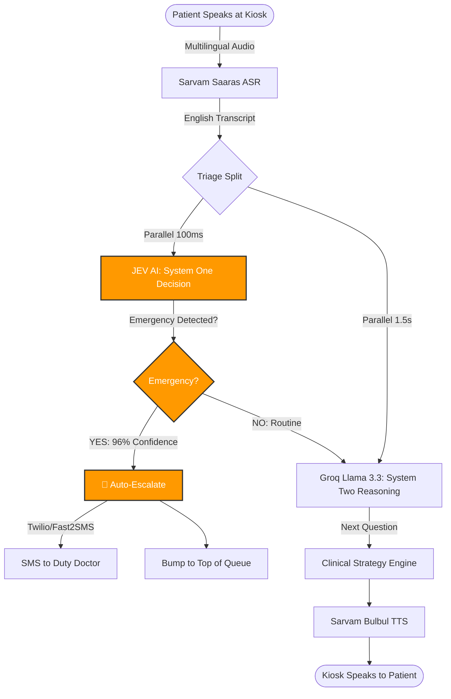
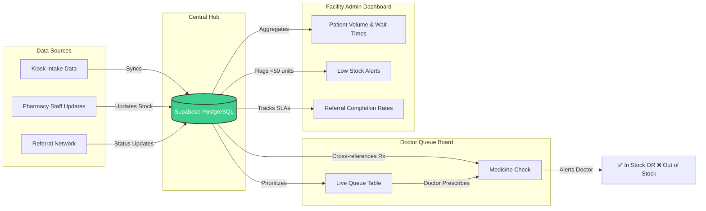

# MediKiosk — PPT Pivot Strategy for PS 26133

**Target Problem Statement:** Accessibility and quality of public healthcare services (PS 26133)

## 1. Core Shift in Narrative
**Is OCR a large part of this new PS?**
**No, it is not.** In the old PS (26047), digitizing paper records was a massive focus. In this new PS (26133), the focus is heavily on **routing, queues, referrals, and rural access**. 
OCR is still useful (it supports the "longitudinal patient records" requirement by digitizing old files), but it should be a minor supporting detail, not a core pillar of your pitch.

---

## 2. Key Changes to Make in Your PPT (Slide by Slide)

Based on the previous Canva design, here is exactly what needs to change:

**Slide 1: Title & PS Info**
*   Update Problem Statement ID to 26133.
*   Update Title: "Accessibility and quality of public healthcare services".

**Slide 2: Problem Identification & Patient Journey**
*   **Remove:** "The AYUSH Complexity Barrier" and "Paper Chaos".
*   **Add:** "The Rural Access Gap" (long travel distances, specialist shortages) and "Fragmented Care" (patients moving between sub-centres and district hospitals without data continuity).
*   **Update Journey:** Change step 2 from "Instant Paper-to-EHR" to "Smart Queue & Triage" (assigning a token and prioritizing emergencies).

**Slide 3: Technical Approach**
*   **Remove:** The massive RAG INJECTION section and shrink the DOCUMENT DIGITALIZATION section to just one small box.
*   **Add:** A prominent section for **Jev AI (System One)** replacing the standard LLM for triage.
*   **Add:** The Facility Dashboard, Queue Management, and Referral Tracking flows (see flowcharts below).

**Slide 4: Feasibility & Viability**
*   **Change Costs:** Instead of focusing on lost prescriptions, focus on the economic cost of **delayed emergencies** and **wasted travel/wait times** for rural patients.

**Slide 5: Impact & Beneficiaries**
*   **Change Beneficiaries:** Instead of "Ministry of Ayush", your beneficiaries are now:
    *   **ASHA/ANM Workers** (frontline support & follow-ups)
    *   **PHC Doctors** (queue management & triage)
    *   **District Health Officers** (facility dashboards & quality monitoring)
    *   **Rural Patients** (reduced travel & wait times)

---

## 3. Flowcharts (For Canva)

### A. Patient Talking System (Highlighting JEV)
*How to explain this to judges: "We don't use slow, hallucination-prone LLMs for life-and-death decisions. We use Jev, a specialized System One AI, to make 100ms structured triage decisions (Emergency/Urgent/Routine) while the conversational LLM runs in the background."*

### B. Dashboard & Medicine Availability System
*How to explain this to judges: "Our system bridges the gap between the waiting room and the pharmacy. When a doctor generates a prescription from our AI summary, the system instantly cross-references the live pharmacy database. The Admin Dashboard sits on top of this, giving District Health Officers a real-time view of stockouts, wait times, and referral drops across all rural centres."*

